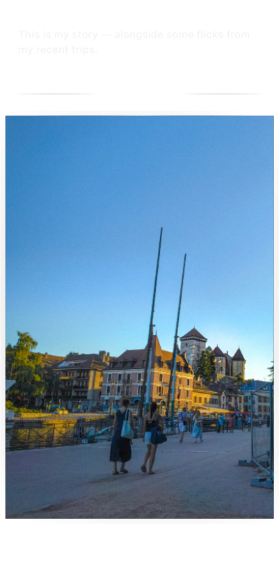
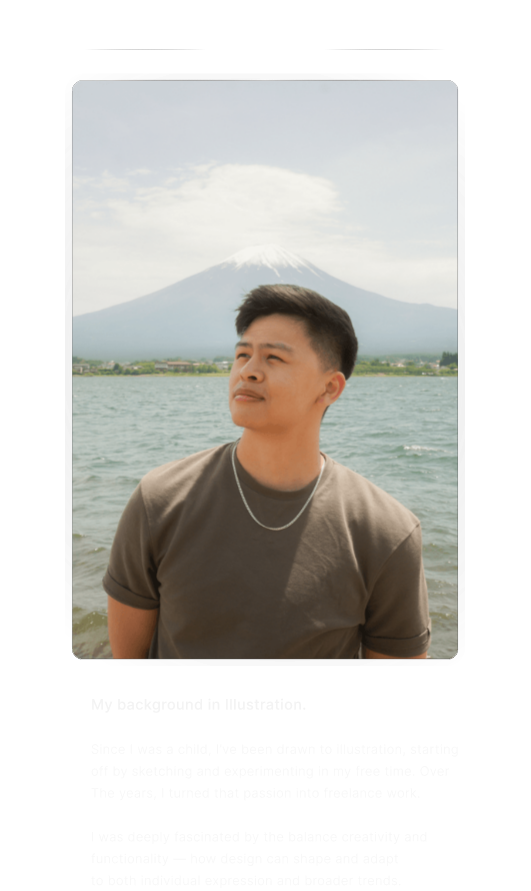
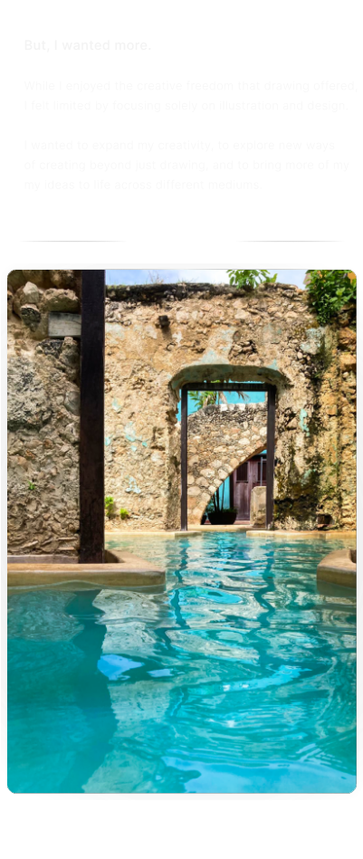
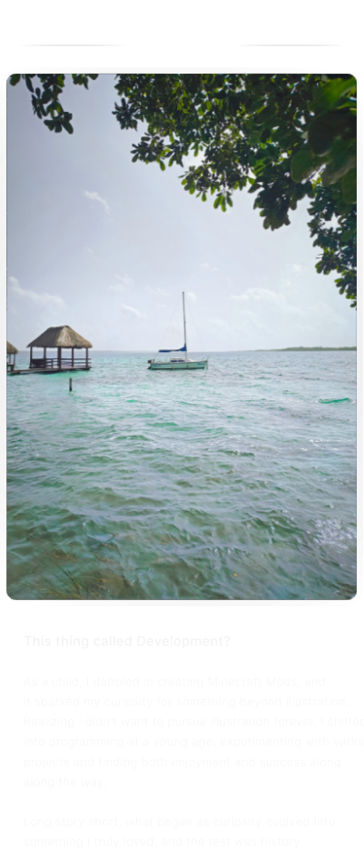
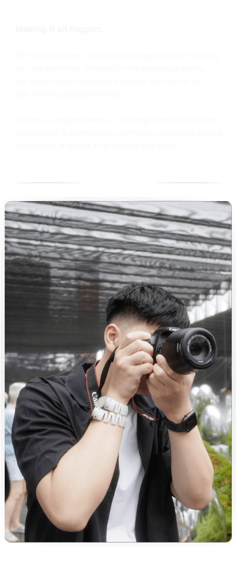

<!-- LEGIBILITY -->
<picture>
  
</picture>

<!-- HEADER SECTION -->

  
  
  

<!-- HERO SECTION -->

<picture>
  
</picture>

<picture>
  
</picture>

<!-- ABOUT ME SECTION -->

<picture>
  
</picture>

  <picture>
    
  </picture>
  <picture>
    
  </picture>

  <picture>
    
  </picture>
  <picture>
    
  </picture>

  <picture>
    
  </picture>
  <picture>
    
  </picture>

<picture>
  
</picture>

<!-- EXPERIENCE SECTION -->

<picture>
  
</picture>

  

  
  <picture>
    
  </picture>

  

  
  <picture>
    
  </picture>

  

  
  <picture>
    
  </picture>

  

  
  <picture>
    
  </picture>

  

  
  <picture>
    
  </picture>

  

<picture>
  
</picture>

<!-- PROJECTS SECTION -->

<picture>
  
</picture>

<picture>
  
</picture>

<!-- STACKS SECTION -->

<picture>
  
</picture>

<picture>
  
</picture>

<!-- FRIENDS SECTION -->

<picture>
  
</picture>

 

  
  
  

 

<picture>
  
</picture>

<!-- FOOTER SECTION -->
  

<picture>
  
</picture>

<picture>
  
</picture>
